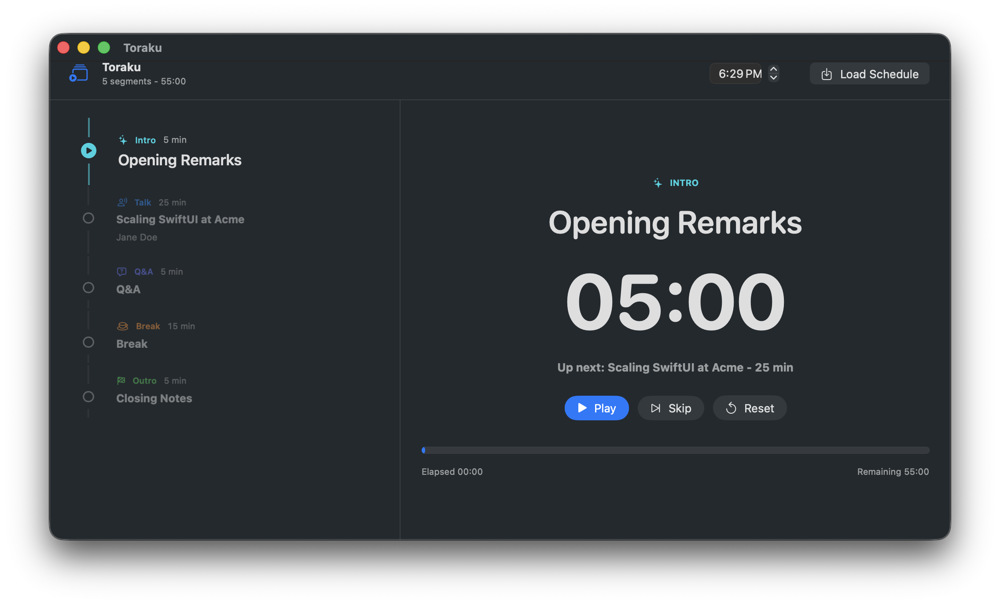

# Toraku

Simple time tracking for events



## Example Event

Toraku loads event schedules from a simple JSON array. Each segment has a title,
duration in minutes, and type. Speaker is optional.

```json
[
  {
    "title": "Opening Remarks",
    "durationMinutes": 5,
    "type": "intro"
  },
  {
    "title": "Scaling SwiftUI at Acme",
    "speaker": "Jane Doe",
    "durationMinutes": 25,
    "type": "talk"
  },
  {
    "title": "Q&A",
    "durationMinutes": 5,
    "type": "qa"
  },
  {
    "title": "Break",
    "durationMinutes": 15,
    "type": "break"
  },
  {
    "title": "Closing Notes",
    "durationMinutes": 5,
    "type": "outro"
  }
]
```

Set the event start time in the header. The timer follows the scheduled event
clock, so if an event starts at 10:00 and you press Play at 10:15, Toraku shows
15 minutes already elapsed.
